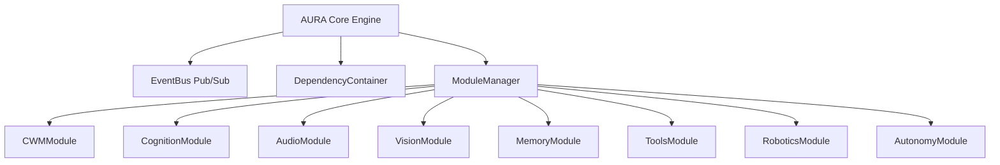

# AURA — Adaptive Unified Reasoning Assistant

> **Plataforma Cognitiva Modular, Multimodal y Autónoma**

AURA es un asistente cognitivo avanzado diseñado con arquitectura distribuida basada en eventos, modelo de mundo persistente (Cognitive World Model - CWM), procesamiento multimodal (voz y visión), memoria a largo plazo, control de herramientas digitales, interacción robótica espacial y motor de autonomía adaptativa.

---

## 🌟 Características Principales

- **🏛️ Arquitectura Modular Decoupled**: 8 módulos centrales administrados mediante `ModuleManager` e IoC container (`DependencyContainer`).
- **⚡ Bus de Eventos Asíncrono (`EventBus`)**: Comunicación desacoplada basada en el patrón Pub/Sub con soporte para filtrado y eventos inmutables.
- **🌐 Cognitive World Model (`CWM`)**: Grafo persistente de conocimiento para representar entidades y relaciones del entorno físico y digital.
- **🗣️ Procesamiento de Audio & Voz (`AudioModule`)**: Reconocimiento del habla (STT), síntesis de voz (TTS), detección de palabra de activación (*Wake Word*) y detector de silencio.
- **👁️ Percepción Visual (`VisionModule`)**: Procesamiento de fotogramas, OCR de texto, reconocimiento facial y detección de personas/objetos.
- **🧠 Memoria a Largo Plazo (`MemoryModule`)**: Memoria episódica, semántica, preferencias de usuario y motor de consolidación.
- **🛠️ Sistema de Herramientas (`ToolsModule`)**: Control seguro y registro dinámico de aplicaciones (Archivos, Navegador, Calendario, Spotify, Correo, APIs REST).
- **🦾 Interfaz Robótica Espacial (`RoboticsModule`)**: Control de actuadores/motores, telemetría de sensores, navegación por waypoints, manipulación de objetos y paro de emergencia de seguridad (E-Stop).
- **🎯 Motor de Autonomía Adaptativa (`AutonomyModule`)**: Gestión de metas autónomas, priorización dinámica, planificación a largo plazo (*Long-Horizon Planner*) y aprendizaje continuo.

---

## 🏗️ Arquitectura del Sistema



### Tabla de Módulos Centrales

| Módulo | Descripción | Prioridad |
| :--- | :--- | :---: |
| **`cwm`** | Grafo de entidades y relaciones persistente en disco | 10 |
| **`cognition`** | Máquina de estados cognitivos, razonamiento, planificación y acciones | 20 |
| **`audio`** | STT, TTS, Wake Word y detector de silencio | 30 |
| **`vision`** | Cámara, OCR, reconocedor facial y detectores visuales | 35 |
| **`memory`** | Memoria episódica, semántica, preferencias y consolidación | 25 |
| **`tools`** | Registro y ejecución de herramientas digitales externas | 40 |
| **`robotics`** | Control de motores, telemetría, navegación espacial, manipulación y E-Stop | 55 |
| **`autonomy`** | Gestión de metas autónomas, priorización y aprendizaje adaptativo | 60 |

---

## 🚀 Inicio Rápido

### Requisitos Previos
- Python 3.14+
- `uv` (Administrador de paquetes y entornos virtuales)

### Instalación

1. **Clonar el repositorio:**
   ```bash
   git clone https://github.com/GermanMejiaH/AURA.git
   cd AURA
   ```

2. **Instalar dependencias en entorno virtual editable:**
   ```bash
   uv pip install -e .
   ```

3. **Ejecutar la Consola Interactiva (CLI):**
   ```bash
   .\.venv\Scripts\aura-cli
   # O alternativamente:
   .\.venv\Scripts\python src/aura/cli.py
   ```

---

## 💻 Uso de la Consola CLI (`aura-cli`)

Al iniciar `aura-cli`, los 8 módulos de AURA se inicializan en menos de **4ms**. Puedes utilizar los siguientes comandos interactivos:

```text
Comandos disponibles:
  status         - Muestra el estado del sistema y salud de módulos
  cwm            - Muestra las entidades en el Cognitive World Model
  tools          - Lista las herramientas digitales disponibles
  exec <tool>    - Ejecuta una herramienta digital (ej: exec browser_tool)
  say <texto>    - Envia una entrada de voz al sistema (SpeechRecognized)
  see <objeto>   - Envia una percepción visual (ObjectDetected)
  goal <texto>   - Crea un objetivo autónomo (GoalSet)
  nav <x> <y>    - Desplaza el cuerpo robótico a una coordenada
  exit           - Apaga AURA y sale de la consola
```

### Ejemplo de Sesión CLI
```text
AURA> status
Estado: RUNNING
  • Módulo 'cwm': Prioridad 10
  • Módulo 'cognition': Prioridad 20
  • Módulo 'memory': Prioridad 25
  • Módulo 'audio': Prioridad 30
  • Módulo 'vision': Prioridad 35
  • Módulo 'tools': Prioridad 40
  • Módulo 'robotics': Prioridad 55
  • Módulo 'autonomy': Prioridad 60

AURA> tools
Herramientas Registradas (6):
  • file_tool [system]: Reads, writes and lists files in workspace
  • browser_tool [web]: Simulates web browsing and page content extraction
  • calendar_tool [productivity]: Manages calendar events and reminders
  • spotify_tool [media]: Controls music playback on Spotify
  • email_tool [communication]: Sends and reads emails
  • api_tool [network]: Executes generic REST API HTTP requests

AURA> exec browser_tool
Salida: Extracted content from https://example.com (0.12ms)
```

---

## 🧪 Pruebas Automatizadas y Calidad de Código

AURA cuenta con una suite completa de pruebas unitarias, de integración y de sistema (End-to-End).

```bash
# Ejecutar todas las 104 pruebas automatizadas
.\.venv\Scripts\pytest

# Ejecutar auditoría de linter (Ruff)
.\.venv\Scripts\ruff check src tests

# Ejecutar verificación estática de tipos (MyPy)
.\.venv\Scripts\mypy src/aura
```

### Métricas de Calidad
- **Pruebas de Pytest**: `104 passed in 2.48s` (100% de éxito).
- **Ruff Linter**: `All checks passed!`
- **MyPy**: `Success: no issues found in 74 source files`
- **Arranque del Core Engine**: `0.002s - 0.004s`

---

## 📄 Documentación del Proyecto (`docs/`)

La carpeta `docs/` contiene las especificaciones detalladas del proyecto:

- **[ROADMAP-001](file:///c:/Users/Andres/Desktop/AURA/docs/ROADMAP-001%20%E2%80%94%20Product%20Roadmap.md)**: Hoja de ruta de las 9 fases de desarrollo.
- **[ARCH-001](file:///c:/Users/Andres/Desktop/AURA/docs/AURA%20Architecture%20Handbook.md)**: Manual de arquitectura y principios de ingeniería.
- **[SPEC-001](file:///c:/Users/Andres/Desktop/AURA/docs/SPEC-001%20%E2%80%94%20Cognitive%20Architecture.md)**: Especificación de la arquitectura cognitiva.
- **[SPEC-002](file:///c:/Users/Andres/Desktop/AURA/docs/SPEC-002%20%E2%80%94%20Cognitive%20World%20Model%20%28CWM%29.md)**: Especificación del modelo de mundo (CWM).
- **[SPEC-003](file:///c:/Users/Andres/Desktop/AURA/docs/SPEC-003%20%E2%80%94%20Core%20System.md)**: Especificación del Core y motor de ciclo de vida.
- **[MODULES_GUIDE](file:///c:/Users/Andres/Desktop/AURA/docs/MODULES_GUIDE.md)**: Guía detallada de API de los 8 módulos del sistema.
- **[COMPLETION_REPORT](file:///c:/Users/Andres/Desktop/AURA/docs/COMPLETION_REPORT.md)**: Informe oficial de finalización de fases.

---

## 📜 Licencia

Desarrollado bajo principios de software libre y modularidad estándar para investigación y desarrollo cognitivo.
