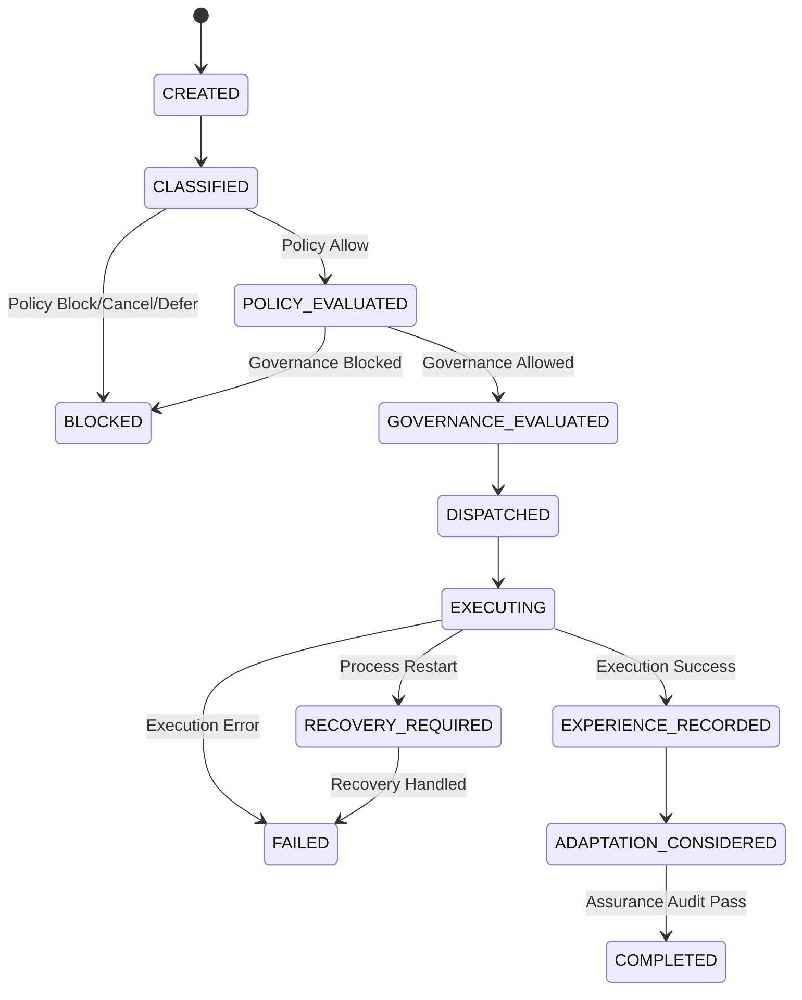

# AURA 1.6 — Runtime State Machine Audit

## 1. Executive Summary
This document provides a formal audit of all finite state machines across Stages 10–16 of AURA 1.6 (Governance, Runtime Policy, Transactional Execution, Experience, Adaptive Policy, Runtime Assurance, and Runtime Orchestration). It audits terminal states, transient states, valid transitions, invalid transition prevention, recovery paths, and orphan state prevention.

---

## 2. Stage-by-Stage State Machine Inventory

### 2.1 Stage 10 — Governance Engine (`AutonomyScope` & `CircuitState`)
- **AutonomyScope**: `DISABLED`, `READ_ONLY`, `ASSISTED`, `SUPERVISED`, `AUTONOMOUS`, `FULL_AUTONOMY`, `UNRESTRICTED`.
  - *Transient States*: N/A (Configuration Driven).
  - *Terminal States*: `DISABLED` acts as an absolute operational kill-switch.
  - *Immutability Rule*: Scope elevation to `UNRESTRICTED` or downgrading below current governance policy is strictly controlled via `RuntimeGovernanceEngine.set_authority_scope()`.
- **CircuitState**: `CLOSED` (Normal), `HALF_OPEN` (Trial/Probe), `OPEN` (Tripped/Quarantined).
  - *Valid Transitions*: `CLOSED -> OPEN` (Threshold exceeded), `OPEN -> HALF_OPEN` (Cool-off expired), `HALF_OPEN -> CLOSED` (Probe success), `HALF_OPEN -> OPEN` (Probe failure).
  - *Invalid Transitions*: Direct `OPEN -> CLOSED` without `HALF_OPEN` probing (unless forced by authorized operator override).

### 2.2 Stage 11 — Runtime Policy Engine (`PolicyAction` & `PriorityMode`)
- **PolicyAction**: `ALLOW`, `DEFER`, `CANCEL`, `BLOCK`, `PREEMPT`.
  - *Terminal States*: `CANCEL`, `BLOCK`.
  - *Transient States*: `DEFER`, `PREEMPT`.
  - *Enforcement Rule*: If `PolicyAction` resolves to `CANCEL`, `BLOCK`, or `DEFER`, the operation is halted at Stage 11 before reaching Stage 10 Governance or Stage 12 Execution.

### 2.3 Stage 12 — Transactional Execution Engine (`ExecutionState`)
- **States**: `PENDING`, `PREPARING`, `VALIDATING`, `EXECUTING`, `COMMITTING`, `COMMITTED`, `ROLLING_BACK`, `ROLLED_BACK`, `COMPENSATING`, `COMPENSATED`, `FAILED`, `CANCELLED`, `TIMED_OUT`.
  - *Transient States*: `PENDING`, `PREPARING`, `VALIDATING`, `EXECUTING`, `COMMITTING`, `ROLLING_BACK`, `COMPENSATING`.
  - *Terminal Success*: `COMMITTED`.
  - *Terminal Recovery/Handled*: `ROLLED_BACK`, `COMPENSATED`.
  - *Terminal Failure*: `FAILED`, `CANCELLED`, `TIMED_OUT`.
  - *Invalid Transitions*: `COMMITTED -> EXECUTING`, `ROLLED_BACK -> EXECUTING`, `FAILED -> COMMITTED`.

### 2.4 Stage 13 — Outcome Memory (`OutcomeType` & `ExperienceConfidence`)
- **OutcomeType**: `SUCCESS`, `FAILURE`, `TIMED_OUT`, `CANCELLED`, `ROLLED_BACK`, `COMPENSATED`.
  - *Immutability*: Records in `OutcomeRecord` are immutable once saved to SQLite (`runtime_outcomes`).

### 2.5 Stage 14 — Adaptive Policy Engine (`AdaptationStatus`)
- **AdaptationStatus**: `PROPOSED`, `PENDING_APPROVAL`, `APPROVED`, `REJECTED`, `VALIDATED`, `APPLIED`, `ROLLED_BACK`, `EXPIRED`, `BLOCKED`.
  - *Transient States*: `PROPOSED`, `PENDING_APPROVAL`, `VALIDATED`.
  - *Terminal Non-Applied*: `REJECTED`, `EXPIRED`, `BLOCKED`.
  - *Terminal Applied*: `APPLIED` (Can transition to `ROLLED_BACK`).
  - *Human-in-the-Loop Constraint*: `APPROVED` **NEVER** automatically transitions to `APPLIED`. Transition to `APPLIED` requires an explicit, authenticated `apply_adaptation()` call.

### 2.6 Stage 15 — Runtime Assurance Engine (`AssuranceStatus` & `AssuranceSeverity`)
- **AssuranceStatus**: `HEALTHY`, `DEGRADED`, `RECOVERING`, `RECOVERED`, `FAILED`, `SAFE_MODE`.
  - *Quarantine State*: `SAFE_MODE` (Triggered automatically by `CRITICAL` invariant violations).
  - *Invalid Transitions*: Exiting `SAFE_MODE -> HEALTHY` while unresolved `CRITICAL` invariant violations exist.

### 2.7 Stage 16 — Runtime Orchestrator (`RuntimeOperationState`)
- **RuntimeOperationState**: `CREATED`, `CLASSIFIED`, `POLICY_EVALUATED`, `GOVERNANCE_EVALUATED`, `DISPATCHED`, `EXECUTING`, `COMPLETED`, `FAILED`, `CANCELLED`, `BLOCKED`, `TIMED_OUT`, `RECOVERY_REQUIRED`, `EXPERIENCE_RECORDED`, `ADAPTATION_CONSIDERED`.
  - *Transient States*: `CREATED`, `CLASSIFIED`, `POLICY_EVALUATED`, `GOVERNANCE_EVALUATED`, `DISPATCHED`, `EXECUTING`, `EXPERIENCE_RECORDED`, `ADAPTATION_CONSIDERED`.
  - *Terminal States*: `COMPLETED`, `FAILED`, `CANCELLED`, `BLOCKED`, `TIMED_OUT`.
  - *Restart Recovery State*: `RECOVERY_REQUIRED`.

---

## 3. Transition Matrix & Invalid Transition Rejection

### Prohibited Invalid Transitions
1. `COMPLETED -> EXECUTING` (Rejected: Terminal operation cannot be re-executed).
2. `FAILED -> EXECUTING` (Rejected: Failed operation must spawn a new operation with new `operation_id`).
3. `CANCELLED -> COMPLETED` (Rejected: Cancelled operation is immutable).
4. `BLOCKED -> EXECUTING` (Rejected: Blocked operation cannot bypass governance/policy).
5. `APPROVED -> APPLIED` (Auto-transition prohibited: Requires explicit HITL invocation).

---

## 4. Concurrency Safety & Orphan State Prevention
- All state transitions use `threading.RLock()` and SQLite transaction locks (`BEGIN IMMEDIATE` / `COMMIT`).
- Operations in-flight during a crash are detected on restart and transitioned to `RECOVERY_REQUIRED`, preventing orphan `EXECUTING` states.
