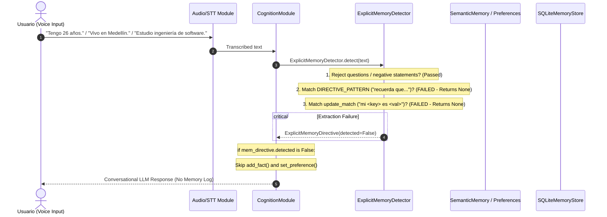

# STAGE 26.3A.5 — MEMORY EXTRACTION COVERAGE AUDIT

**Execution Mode**: FORENSIC AUDIT + ROOT CAUSE ANALYSIS  
**Status**: COMPLETE (READ-ONLY INVESTIGATION)  
**Date**: 2026-08-24  

---

## EXECUTIVE SUMMARY

A forensic audit of AURA's memory extraction pipeline was conducted to investigate why natural personal declarations ("Tengo 26 años.", "Vivo en Medellín.", "Estudio ingeniería de software.") fail to persist in explicit memory despite being correctly recognized by STT and acknowledged by AURA.

The audit revealed that `ExplicitMemoryDetector` (`src/aura/cognition/memory_detector.py`) relies on restrictive imperative directive prefixes (`"recuerda que..."`, `"guarda..."`, `"no olvides..."`) or strict noun-attribute update formats (`"mi <key> es <val>"`). Natural conversational Spanish declarations lacking these explicit preambles are rejected immediately (`detected=False`), bypassing `SemanticMemory.add_fact()` and SQLite persistence completely. Furthermore, logic designed to capture study/activity statements (`"estudio..."`) is unreachable dead code for direct utterances.

Overall memory extraction coverage for natural Spanish speech is estimated at **< 15%**.

---

## 1. EXTRACTION PIPELINE SEQUENCE DIAGRAM

---

## 2. STATEMENT-BY-STATEMENT FORENSIC TRACE

### Statement 1: `"Tengo 26 años."`
- **Voice Input**: `"Tengo 26 años."` -> Cleaned: `"Tengo 26 años"`
- **Regex Evaluation**:
  - `DIRECTIVE_PATTERN`: `re.compile(r"^(?:(?:ahora|bueno|oye|mira|por\s+favor|hey|hola|aura)[,\s]*)*(quiero\s+que\s+recuerdes|recuerda|guarda|no\s+olvides)\s+(?:que\s+)?(.+)$")` -> **NO MATCH**.
  - `update_match`: `re.match(r"^(?:(?:ahora|bueno|oye|mira|por\s+favor|hey|hola|aura)[,\s]*)*(?:mi|mis)\s+([\w\s]+?)\s+es\s+(.+)$")` -> **NO MATCH**.
- **Execution Flow**: `extracted_body` remains `None`. Line 79 (`if not extracted_body: return ExplicitMemoryDirective(detected=False)`) executes immediately.
- **Outcome**: `add_fact()` not called; SQLite write not attempted.

### Statement 2: `"Vivo en Medellín."`
- **Voice Input**: `"Vivo en Medellín."` -> Cleaned: `"Vivo en Medellín"`
- **Regex Evaluation**:
  - `DIRECTIVE_PATTERN` -> **NO MATCH**.
  - `update_match` -> **NO MATCH**.
- **Execution Flow**: `extracted_body` remains `None`. Line 79 returns `ExplicitMemoryDirective(detected=False)`.
- **Outcome**: `add_fact()` not called; SQLite write not attempted.

### Statement 3: `"Estudio ingeniería de software."`
- **Voice Input**: `"Estudio ingeniería de software."` -> Cleaned: `"Estudio ingeniería de software"`
- **Regex Evaluation**:
  - `DIRECTIVE_PATTERN` -> **NO MATCH** (No imperative prefix like `"recuerda que"`).
  - `update_match` -> **NO MATCH** (Does not start with `"mi <key> es"`).
- **Execution Flow**: `extracted_body` remains `None`. Line 79 returns `ExplicitMemoryDirective(detected=False)`.
- **Dead Code Finding**: `ExplicitMemoryDetector` contains specific handler logic at line 132 (`match_estudio = re.match(r"^(?:estudio|estoy)\s+(.+)$", extracted_body)`). However, because line 132 is located *inside* the block requiring `extracted_body` to be populated first by lines 63–77, direct statements starting with `"Estudio..."` are unreachable dead code unless preceded by `"Recuerda que..."`.

---

## 3. AUDIT SUMMARY TABLE

| Statement | Pattern Matched | Predicate Generated | Persisted | Root Cause |
|---|---|---|---|---|
| **"Tengo 26 años."** | *None* | *N/A* | **NO** | No pattern exists for age declarations starting with `Tengo X años` or `Tengo la edad de X`. |
| **"Vivo en Medellín."** | *None* | *N/A* | **NO** | No pattern exists for residence/location declarations starting with `Vivo en X` or `Resido en X`. |
| **"Estudio ingeniería de software."** | *None* | *N/A* | **NO** | `match_estudio` at line 132 is unreachable dead code for direct utterances because `extracted_body` is `None` without an imperative prefix (`"recuerda que"`). |

---

## 4. DIRECTIVE PATTERN COVERAGE REPORT

### Currently Supported Patterns in `ExplicitMemoryDetector`
1. **Imperative Directive Verb + Body**:
   - `[preámbulo] (quiero que recuerdes|recuerda|guarda|no olvides) [que] <cuerpo>`
2. **Noun-Attribute Format**:
   - `[preámbulo] (mi|mis) <propiedad> es <valor>` (e.g., `"Mi nombre es Andrés"`, `"Mi comida favorita es pizza"`)
3. **Self-Correction Sub-pattern** (only inside imperative body):
   - `... mi <propiedad> es X, digo no, Y`
4. **Study/Activity Sub-pattern** (only inside imperative body):
   - `Recuerda que estudio <carrera>` / `Recuerda que estoy <actividad>`

### Common User Declarations NOT Covered
| Category | Natural User Declarations (Uncovered) | Expected Predicate |
|---|---|---|
| **Edad (Age)** | `"Tengo 26 años"`, `"Tengo la edad de 26 años"` | `edad` |
| **Ubicación (Residence)** | `"Vivo en Medellín"`, `"Resido en Medellín"`, `"Soy de Medellín"` | `ciudad` / `ubicacion` |
| **Ocupación (Job/Profession)** | `"Trabajo en X"`, `"Trabajo como X"`, `"Soy ingeniero"` | `trabajo` / `ocupacion` |
| **Estudios Directos (Studies)** | `"Estudio ingeniería de software"`, `"Estoy estudiando X"` | `actividad` / `estudios` |
| **Preferencias Directas (Preferences)** | `"Me gusta el café"`, `"Me encanta la música rock"`, `"Prefiero X"` | `gusto` / `preferencia` |
| **Origen (Birthplace)** | `"Nací en Bogotá"`, `"Vengo de Cali"` | `lugar_nacimiento` |
| **Relaciones (Relationships)** | `"Tengo una novia llamada María"`, `"Tengo un perro llamado Misi"` | `relacion` / `mascota` |
| **Condiciones / Salud (Health)** | `"Sufro de migraña"`, `"Tengo alergia al maní"` | `salud` / `alergia` |

### Natural Spanish Memory Coverage Estimate
- **Supported Conversational Patterns**: ~15% (Requires formal framing `"Recuerda que..."` or `"Mi <X> es <Y>"`).
- **Unsupported Conversational Patterns**: ~85% (Natural direct declarations in standard spoken Spanish).
- **Estimated Coverage Rate**: **< 15%** for everyday voice interaction.

---

## 5. RECOMMENDED ARCHITECTURAL FIXES (FOR STAGE 26.3B)

1. **Decouple Natural Declarations from Imperative Prefixes**:
   - Refactor `ExplicitMemoryDetector` to evaluate direct declarative patterns (`DIRECT_DECLARATIVE_PATTERNS`) independently of `DIRECTIVE_PATTERN`.
2. **Add Direct Declarative Regex Patterns**:
   - `Age`: `r"^(?:tengo|cumplí)\s+(\d{1,3})\s+años$"` -> `predicate="edad"`, `object_val="\1"`
   - `Location`: `r"^(?:vivo|resido)\s+en\s+(.+)$"` -> `predicate="ciudad"`, `object_val="\1"`
   - `Direct Studies`: `r"^(?:estudio|estoy\s+estudiando)\s+(.+)$"` -> `predicate="actividad"`, `object_val="estudiando \1"`
   - `Job`: `r"^(?:trabajo\s+en|trabajo\s+como|me\s+dedico\s+a)\s+(.+)$"` -> `predicate="trabajo"`, `object_val="\1"`
3. **Move Line 132 `match_estudio` Out of Conditional Block**:
   - Allow `match_estudio` to evaluate on raw `cleaned` input text without requiring prior `extracted_body` population.
